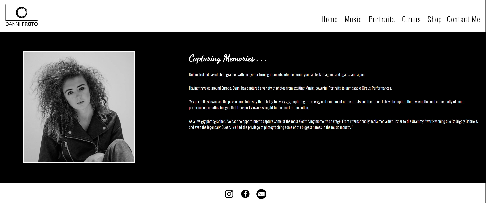
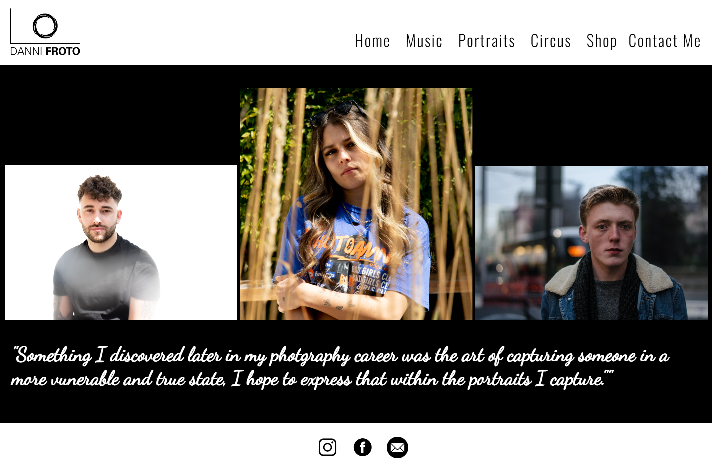
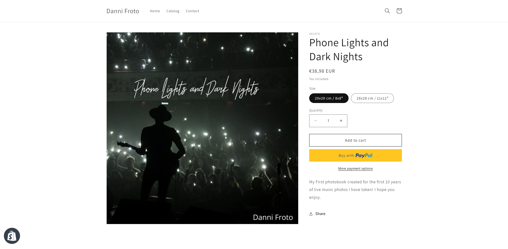
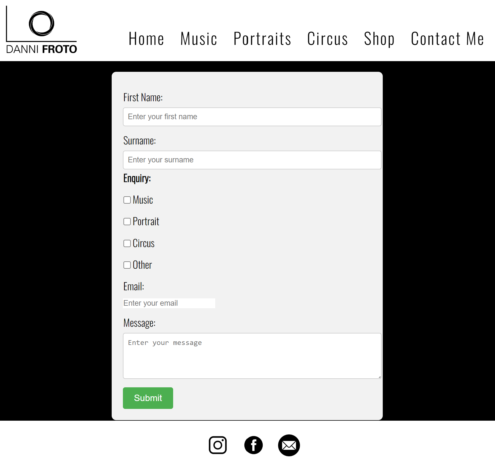
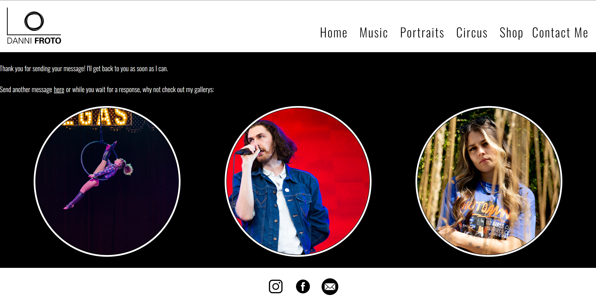
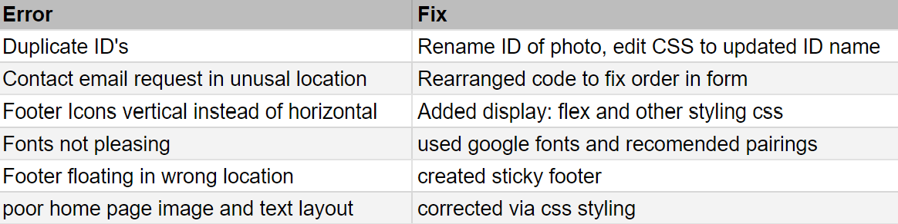
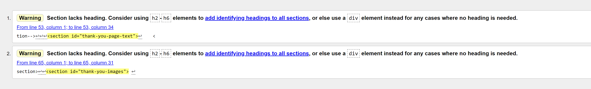

# DANNI FROTOGRAPHY

This website showcases the photography work of Irish photographer, Danni Froto. It features her music, portraits, and circus photography. It was created as Portfolio 1: Diploma in Full Stack Software Development (E-commerce Applications).

[Danni Frotography Website](https://dannironan.github.io/Danni-Frotography/)

## User:

As a visitor to the website, I want to be able to:

- Navigate through the different photo galleries (music, portraits, circus).
- Quickly view high-quality but fast loading images.
- Read about who Danni Froto is and why she takes the photos she does.
- Contact Danni via the form or social media pages.
- Purchase directly from the store page with ease.

## Features of the website:

- Navigation Bar: Allows users to easily navigate between different pages and photography categories.
- Home Page: Features a 'hero image' and introductory text.
- Photo Galleries: Shows images categorized into music, portraits, and circus, allowing users to view exactly what they want.
- Contact: Offers a contact form for users to message Danni directly.

## Possible enhancements to consider:

- Gallery: Incorporate more images into a slideshow gallery.
- Blog page: Allow users to read about what Danni is up to on a more regular basis.
- Store: Build the store directly into the website with a Shopify widget.
- Testimonials: Display feedback quotes from previous clients beneath the galleries.

## Structure:

- Header/Navigation: Displays the Danni Froto Logo and provides consistent and easy access across the webpage.
- Footer: Contains social media links for users to find Danni Froto elsewhere and a direct link to the contact page.
- Sections: Varies depending on the page.
  - Home: Includes an image and bio for Danni Froto.
  - Gallery Pages: Show three relevant images and a quote.
  - Contact: Contains a contact form.

## Page Break down:
- Header: Consistent across all pages, showing Danni Froto logo and navigational links to Home, 3 gallery pages, external store page, contact form page.
- Footer: Provides external links to Facebook and Instagram. Provides link to contact page.

- Home : Features hero image as well as a brief bio about Danni Froto as well as some quotes from her.

- Music Gallery: Features 3 images taken by Danni Froto in order to showcase her gig photography work as well as a quote about the work.

- Portrait Gallery: Features 3 images taken by Danni Froto in order to showcase her portrait photography work as well as a quote about the work.

- Circus Gallery: Features 3 images taken by Danni Froto in order to showcase her circus photography work as well as a quote about the work.

- Shop: Brings users to an external shopify link in a new tab where they can purchase up a copy of her book. 

- Contact Me: Allows users to send Danni Froto a direct message via the form provided, once submitted users will receive a thank you message where they can divert back to send another message or click to the galleries in order to view them.

- I ensured pages worked correctly across different screen sizes.

## Fixed Bugs

## Known Bugs

- This bug is present across the gallery pages on the website, however I chose to leave it as it is, the site has div elements. I chose not to add additonal Header elements eg. H2, as I liek the layout as it is. 

## Technologies Used

The following technologies were used in the development of the Danni Frotography website:

- HTML
- CSS
- Markdown
- Google Fonts (for typography)
- Testing: Manual testing, Peer review, Mentor Meetings, Tutor meetings

## Deployment

The Danni Frotography website was deployed using a web hosting service. The project's code was pushed to a Git repository, and the website is accessible through its live URL here: [Danni Frotography Website](https://dannironan.github.io/Danni-Frotography/)

## Credits

- Hero Image: Image by Danni Froto
- Photography Images: Images sourced from Danni Frotography's portfolio
- Fonts: Google Fonts
- Icons: Font Awesome
- Code and Guidance: Inspired by code examples and guidance from mentors and online resources

## Reference sources:

- Fonts: [Google Fonts](https://fonts.google.com/)
- Borders: [W3Schools - CSS Border](https://www.w3schools.com/css/css_border.asp)
- Opening new tab: [WordPress Forums - Open Custom HTML Link in New Tab](https://wordpress.com/forums/topic/how-to-open-custom-html-link-to-open-in-new-tab/#:~:text=You%20can%20make%20a%20HTML,target%3D%E2%80%9D_blank%E2%80%9D%20attribute.)
- Photo Gallery: [MakeUseOf - Image Gallery with HTML, CSS, and JavaScript](https://www.makeuseof.com/image-gallery-html-css-javascript/)
- Form: [Typeform - Form Builder](https://www.typeform.com/try/form-builder/)
- Read.Me: [GitHub - Jane B. McKenna - Milestone Project 1](https://github.com/janebmckenna/milestone-project-1)
- CSS: [CSS-Tricks - A Guide to Flexbox](https://css-tricks.com/snippets/css/a-guide-to-flexbox/)
- Grid: [CSS-Tricks - A Complete Guide to Grid](https://css-tricks.com/snippets/css/complete-guide-grid/)
- CSS Validation: [W3C CSS Validator](https://jigsaw.w3.org/css-validator/)
- HTML Validation: [W3C Markup Validation Service](https://validator.w3.org/)
- Sticky Footer: [CSS-Tricks - A Couple Takes Sticky Footer](https://css-tricks.com/couple-takes-sticky-footer/)
- Readme/Markdown: [Noble Desktop - Create a README File](https://www.nobledesktop.com/learn/git/create-a-readme-file)
- Citations in Markdown: [RStudio - Visual Markdown Editing](https://rstudio.github.io/visual-markdown-editing/citations.html#:~:text=You%20insert%20citations%20by%20either,and%20are%20separated%20by%20semicolons.)
- Adding Images to README.md on GitHub: [Stack Overflow - How to Add Images to README.md on GitHub](https://stackoverflow.com/questions/14494747/how-to-add-images-to-readme-md-on-github)

## Acknowledgements

Special thanks to the mentors, tutors, classmates, and others who provided guidance and support during the creation of the Danni Frotography website.
